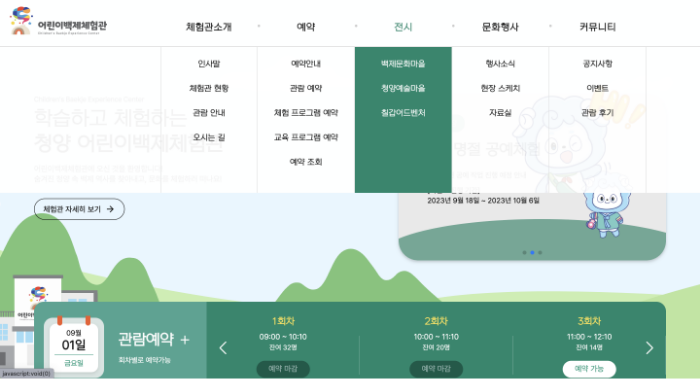
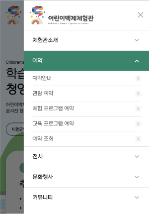

#  cheongyang : 청양 어린이 백제 체험관
배포 링크 : https://seoin-cheongyang.netlify.app  
<br>
## 📣 프로젝트 소개
- 개인 프로젝트
- 목적 
  - 지금까지 공부한 내용을 바탕으로 한 페이지 완성
  - 한 페이지 내에 다수의 스와이퍼 작업
  - 자연스러운 반응형 페이지 목표
- 참고 사이트 : https://www.cheongyang.go.kr/child.do
  - 기존 사이트 카피 및 응용

### 📅 작업 기간
- 2023년 9월 (2주)

### 💻 사용 툴 및 작업 언어
- Adobe XD (디자인) 
- Visual Studio Code
    - html, css, javascript, jQuery 

<br>

## 🎮 주요기능
### 반응형

|web|mobile|
|:---:|:---:|
|||

### 동적 요소
  <table>
    <tr>
      <th colspan="2">메뉴</th>
    </tr>
    <tr>
      <td></td>
      <td></td>
    </tr>
    <tr>
      <td>웹</td>
      <td>모바일</td>
    </tr>
  </table>
    
  <table>
  <tr>
    <th colspan="3">스와이퍼</th>
  </tr>
  <tr>
    <td></td>
    <td></td>
    <td></td>
  </tr>
  <tr>
    <td>메인 이벤트 슬라이더</td>
    <td>관람예약 현황</td>
    <td>각 지역 클릭 시 이미지 슬라이드 변경</td>
  </tr>
  </table>

  <table>
  <tr>
    <th colspan="3">탭 메뉴</th>
  </tr>
  <tr>
    <td></td>
    <td></td>
    <td></td>
  </tr>
  <tr>
    <td>공지사항</td>
    <td>행사소식</td>
    <td>자료실</td>
  </tr>
  </table>

|footer 파도 애니메이션|
|:---:|
||

<br>

***

## 📌 프로젝트 작업하며 얻은 코드
<details>
  <summary>스와이퍼 기본 속성 activeIndex</summary>
  <br>

  1. 스와이퍼 속성인 activeIndex(현재 활성 슬라이드(슬라이더 또는 카루셀)의 인덱스를 나타내는 값)을 사용해 다른 요소와 연결할 수 있다. 이 페이지에선 지도 지역 일러스트의 인덱스와 스와이퍼 인덱스를 일치켰다. 지도 클릭 시 활성화된 듯한 효과를 주면서 그 인덱스에 맞는 슬라이드가 보인다.

      ```javascript
      var swiper3 = new Swiper(".slide", {
        slidesPerView: 1,
        spaceBetween: 0,
        loop: false,
        loopedSlides: 3,
        navigation: {
          nextEl: ".swiper-button-next",
          prevEl: ".swiper-button-prev",
        },
      });
      /* active된 슬라이드와 같은 인덱스의 location 이미지 변경 */
      swiper3.on("slideChange", function () {
        let activeIndex = swiper3.activeIndex;
        console.log("activeIndex: ", activeIndex);
        $(".locationWrap .location").removeClass("on");
        $(".locationWrap .location").eq(activeIndex).addClass("on");
      });
      // 지도 클릭 시 스와이퍼 슬라이드 active
      $(".locationWrap .location").click(function () {
        var index = $(this).index();
        $(".locationWrap .location").removeClass("on");
        $(this).addClass("on");
        swiper3.slideTo(index);
      });

      ```
</details>
<details>
  <summary>스와이퍼 라이브러리의 메서드 changeDirection()</summary>
  <br>

  1. 반응형에 따라 direction의 방향을 다르게 하고 싶을 경우 사용
  2. direction = window.innerWidth <= 769 가 참이면 vertical, 거짓이면 horizontal

      ```javascript
        let swiper2 = new Swiper(".statusSlide", {
          slidesPerView: 3,
          direction: getDirection(),
          navigation: {
            nextEl: ".swiper-button-next",
            prevEl: ".swiper-button-prev",
          },
          autoplay: {
            delay: 2500,
            disableOnInteraction: false,
          },
          loop: true,
          on: {
            resize: function () {
              swiper2.changeDirection(getDirection());
            },
          },
        });

        function getDirection() {
          var windowWidth = window.innerWidth;
          var direction = window.innerWidth <= 769 ? "vertical" : "horizontal";

          return direction;
        }
      ```
</details>
